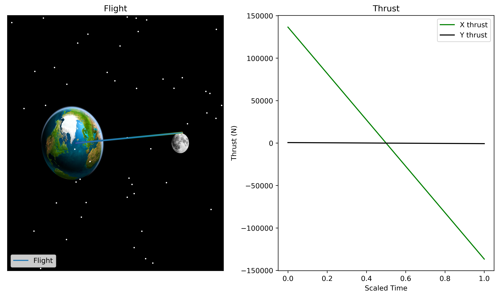
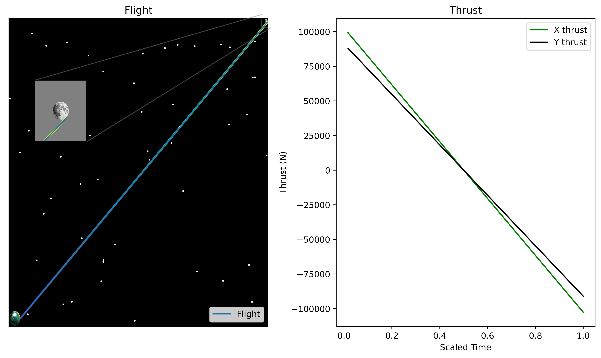

# Lunar Ascent: From Earth to Moon's Orbit

### Dallin Stewart, Jason Vasquez, Dylan Skinner

## Abstract

We present a simulation of a rocket’s path from Earth's surface to the orbit of the Moon. We model the complex dynamics involved in rocket propulsion, gravitational interactions, and orbital mechanics by leveraging differential equations and numerical methods. Our simulation captures the stages of ascent, including liftoff, trajectory optimization, and orbital insertion. Through detailed analysis and visualization, we explore the critical factors influencing orbital maneuvers required for this trajectory. The results offer insights into the challenges and considerations of space exploration, paving the way for future missions to celestial bodies beyond Earth's orbit.

## Background

Space travel presents a highly relevant and classic optimal control problem, influenced by numerous factors such as drag, fuel consumption, gravitational forces from multiple celestial bodies, and varying mass considerations. Navigating a rocket from Earth's surface to the Moon's orbit requires modeling complex dynamics that encompass rocket propulsion, gravitational interactions, and orbital mechanics. We rely on a set of differential equations and numerical methods to simulate and analyze these dynamics in order to accurately optimize trajectory and orbital insertion.

Understanding and optimizing orbital maneuvers for interplanetary travel has been a longstanding challenge in aerospace engineering and space exploration. Previous research has explored various aspects of trajectory optimization, spacecraft propulsion, and orbital transfers to achieve efficient and successful missions beyond Earth's immediate vicinity. One such investigation is "[Minimum-time Earth–Moon and Moon–Earth orbital maneuvers using time-domain finite element method](https://www.sciencedirect.com/science/article/pii/S0094576509003956)" by S.A. Fazelzadeh and G.A. Varzandian that employed a method similar to ours. Another instance of prior research that our project built upon was a Volume 4 example project from 2020 'Rocket Launch Trajectory' by Ahn et. al. This project attempted to reach Earth's orbit, and we wanted to build on this by leaving Earth's orbit and reaching the moon's. Notably, the formulation and solution of optimal control problems have been instrumental in advancing our understanding of spaceflight dynamics and guiding mission planning efforts in order to achieve recent feats such as landing on the moon and Mars.

This study builds upon existing research by focusing on the specific trajectory from Earth's surface to the moon's orbit. By conducting detailed analysis and visualizing critical factors affecting orbital maneuvers, our simulation provides valuable insights into the challenges and considerations of space exploration beyond Earth's orbit. The results obtained pave the way for enhanced mission planning and spacecraft design, contributing to the realization of future missions to celestial bodies throughout the solar system and beyond.

## Mathematical Representation

To solve this problem, we defined a cost functional, a state-space evolution equation, and initial and endpoint conditions. We then utilized Pontraygin’s maximum principle (PMP) to formulate the co-state evolution equations and solve for the optimal control in terms of the co-state. This theorem allows us to set up a boundary-value problem and solve for the state, costate and optimal control. We define the code and steps for this process below. We also made several simplifying assumptions in this project as follows.

Assumptions
1. Rocket, earth, and moon have point mass for the sake of calculating gravity
2. Rocket, earth, and moon are the only objects for the sake of calculating gravity (no influence of the sun, stars, etc)
3. Rocket, earth, and moon lie on a 2D plane
4. Moon's orbit is perfectly circular
5. Rocket's mass does not change
6. Rocket is single stage
7. The earth's position remains at the origin of the 2D plane
8. The moon's position at time zero is on the $x$-axis

Unless otherwise specified, we define the units for this project as follows:
- Mass: kilograms (kg)
- Distance: meters (m)
- Force: newtons (N)
- Angle: degrees (°)
- Speed: meters per second (m/s)
- Time: seconds (s)

### Cost Functional

We seek to find the optimal thrust for a rocket to leave Earth and begin orbiting the moon. To do so, we set up our cost functional as

$$
J[\mathbf{u}] = \int_{0}^{t_f}\frac{c}{2}\|\mathbf{u}(t)\|^2 dt
$$

where we can interpret $$\textbf{u} = \begin{bmatrix}u_x & u_y\end{bmatrix}$$ as the thrust in the $x$- and $y$-directions, respectively. We also define our initial conditions as

$$\begin{aligned}
    x(0) &= R_e, &&x(t_f) = L_m\cos(\theta) + (R_m + h_f)\cos(90 + \theta) \\
    y(0) &= 0, &&y(t_f) = L_m\sin(\theta) + (R_m + h_f)\sin(90 + \theta) \\
    x'(0) &= 0, &&x'(t_f) = v_f\cos(\theta) \\
    y'(0) &= \omega_e, &&y'(t_f) = v_f\sin(\theta) \\
\end{aligned}$$

where

- $c$ is the scaling constant for the cost of thrust
- $R_e$ is the radius of the Earth,
- $L_m$ is the distance from the Earth to the moon,
- $R_m$ is the radius of the moon,
- $h_f$ is the desired height above the moon to enter orbit,
- $v_f$ is the final velocity of the rocket to enter orbit,
- $\omega_e$ is the angular velocity of the Earth at the equator,
- $\theta$ is the angle between the $x$-axis and the line between the Earth and the moon, assuming the Earth is at the origin.

### State Space

We define our state space equation as 

$$\textbf{x} = \begin{bmatrix}x \\ y \\ x' \\ y' \end{bmatrix},$$

and our state space evolution equation as

$$\textbf{x}' = \begin{bmatrix}x' \\ y' \\ x'' \\ y'' \end{bmatrix}$$

where $x''$ and $y''$ are the acceleration in the $x$ and $y$ directions, respectively. Using Newton's second law, this gives:

$$\begin{aligned}
    x'' &= -\frac{G M_e x}{(x^2 + y^2)^{3/2}} \, + \, \frac{GM_m(L_x - x)}{((L_x - x)^2 + (L_y - y)^2)^{3/2}} + \frac{u_x}{m_r} - \frac{\frac{1}{2}cA\rho(x,y)x^{\prime 2}}{m_r} \\
    y'' &= -\frac{GM_e y}{(x^2 + y^2)^{3/2}} \, - \, \frac{GM_m (L_y - y)}{((L_x-x)^2 +(L_y - y)^2)^{3/2}} + \frac{u_y}{m_r} -  \frac{\frac{1}{2}cA\rho(x,y)y^{\prime 2}}{m_r}.
\end{aligned}$$

where

- $G$ is the universal gravitational constant
- $M_e$ is the mass of the Earth
- $M_m$ is the mass of the moon
- $m_r$ is the mass of the rocket
- $u_x$ is the rocket's thrust in the $x$ direction
- $u_y$ is the rocket's thrust in the $y$ direction
- $L_x$ is the $x$ position of the moon
- $L_y$ is the $y$ position of the moon
- $c$ is the drag constant $\frac{1}{4}$
- $A$ is the surface area of the top of the rocket
- $\rho(x,y)$ is the air density at position $(x,y)$

### Hamiltonian

We now derive the Hamiltonian equation. We have

$$\begin{aligned}
    H = \textbf{p}\cdot\textbf{x}' - L &= \begin{bmatrix}p_1 & p_2 & p_3 & p_4 \end{bmatrix}\begin{bmatrix}x' \\ y' \\ x'' \\ y'' \end{bmatrix} - \frac{c}{2}\lVert \textbf{u} \rVert^2 \\
    &= p_1x' + p_2y' + p_3x'' + p_4y'' - \frac{c}{2}u_x^2 - \frac{c}{2}u_y^2.
\end{aligned}$$

Plugging in $x''$ and $y''$ into the Hamiltonian equation, we get

$$\begin{aligned}
    H = p_1x' + p_2y' - &p_3\left(-\frac{G M_e x}{(x^2 + y^2)^{3/2}} \, + \, \frac{GM_m(L_x - x)}{((L_x - x)^2 + (L_y - y)^2)^{3/2}} + \frac{u_x}{m_r} - \frac{\frac{1}{2}cA\rho(x,y)x^{\prime 2}}{m_r}\right) \\
    &- p_4\left(-\frac{GM_e y}{(x^2 + y^2)^{3/2}} \, - \, \frac{GM_m (L_y - y)}{((L_x-x)^2 +(L_y - y)^2)^{3/2}} + \frac{u_y}{m_r} -  \frac{\frac{1}{2}cA\rho(x,y)y^{\prime 2}}{m_r}\right) - \frac{c}{2}u_x^2 - \frac{c}{2}u_y^2.
\end{aligned}$$

### Co-State Evolution

We now derive the necessary equations for the PMP. We first derive the necessary equations for the adjoint equations (co-state evolution). We have

$$\begin{aligned}
    \dot{p}_1  = -\frac{\partial H}{\partial x}  
    = &-p_3\left(\frac{3GM_m(L_x - x)^2}{\left((L_x - x)^2 + (L_y - y)^2\right)^{5/2}} - \frac{GM_m}{\left((L_x - x)^2 + (L_y - y)^2 \right)^{3/2}} + \frac{3GM_ex^2}{(x^2 + y^2)^{5/2}} - \frac{GM_e}{(x^2+y^2)^{3/2}}\right) \\
    &\;-p_4\left(\frac{-3GM_m(L_x - x)(L_y - y)}{\left((L_x - x)^2 + (L_y - y)^2\right)^{5/2}} + \frac{3GM_e xy}{(x^2 + y^2)^{5/2}} \right) \\
    \dot{p}_2 =  -\frac{\partial H}{\partial y} = 
    &-p_3\left(\frac{3GM_m(L_x-x)(L_y - y)}{((L_x-x)^2 + (L_y - y)^2)^{5/2}} + \frac{3GM_exy}{(x^2 + y^2)^{5/2}}\right) \\
    &\;- p_4\left(\frac{-3GM_m(L_y - y)^2}{((L_x-x)^2 + (L_y - y)^2)^{5/2}} + \frac{GM_m}{((L_x-x)^2 + (L_y - y)^2)^{3/2} } + \frac{3GM_ey^2}{(x^2 + y^2)^{5/2}} - \frac{GM_e}{(x^2 + y^2)^{3/2}} \right)  \\
    \dot{p}_3 = -\frac{\partial H}{\partial x'} = \;&-p_1 + \frac{c A \rho(x,y)x^{\prime}}{m_r}\\
    \dot{p}_4 = -\frac{\partial H}{\partial y'} = \;&-p_2 + \frac{c A \rho(x,y)y^{\prime}}{m_r}.
\end{aligned}$$

### Optimal Control

Using $\frac{\partial H}{\partial \tilde{u}}= 0$, we get our optimal control $\tilde{u}$ defined as

$$\begin{equation*}
    \tilde{u} = \frac{1}{c}\begin{bmatrix}p_3 \\ p_4 \end{bmatrix}.
\end{equation*}$$

## Initial Solutions

Our initial attempt at this problem included a stationary moon. This assumption reduced the complexity of our evolution equations and still lead to acceptable results. We included the static location of the moon in the numerical solver by providing the angle $(\theta)$ between the $x$-axis and the line between the Earth and the moon. When the moon was at the origin, $(\theta = 0)$, we achieved the following result.

We see that when the moon is stationary and on the $x$-axis, the rocket takes a straight path to the moon, ending slightly above it in order to enter its orbit. In this visualization, the size of the Earth and moon are not to scale. We increased the size of the Earth and the moon to illustrate the rocket's path.

We also tested our system when the moon was not on the $x$-axis. When the angle between the $x$-axis and the line between the Earth and the moon is set to $\theta = 41.212$ degrees, we achieved the following result.

Similar to when the moon was on the $x$-axis, we see that the rocket takes a straight path to the moon, ending far enough from the moon to enter orbit safely. In this image, the size of the Earth and moon _are_ to scale.

Once we were able to achieve satisfactory results with a stationary moon, we removed this simplifying assumption and allowed the moon to move.

## Future Work

Throughout this project we made several simplifying assumptions. From these assumptions, we achieved satisfactory results and learned more about the complicated dynamics of space travel as we can see in the images above. Despite these results, we feel that the project is not yet at its full potential and could be improved in several ways.

One of the first improvements is implementing variable fuel consumption, thus adding variable weight to the rocket. This improvement would change the rocket's optimal solution and make the problem more realistic.

A second improvement is making the rocket's limitations more realistic. In typical rocket launches, the rocket has at least two phases: a phase inside the Earth's atmosphere and a phase outside the Earth's atmosphere. This design involves a drastic change in the rocket's weight and maximum thrust, which would be a significant change to our model that would allow for a more accurate reflection of the dynamics of a real rocket launch. 

The final improvement we would make is optimizing our system over final time. Including final time in the cost function would allow us to achieve a solution that is not only optimal over thrust, but also over time. Finding the optimal time to reach the moon would make the results of the system much more interesting and would potentially lead to new insights into the dynamics of space travel.
