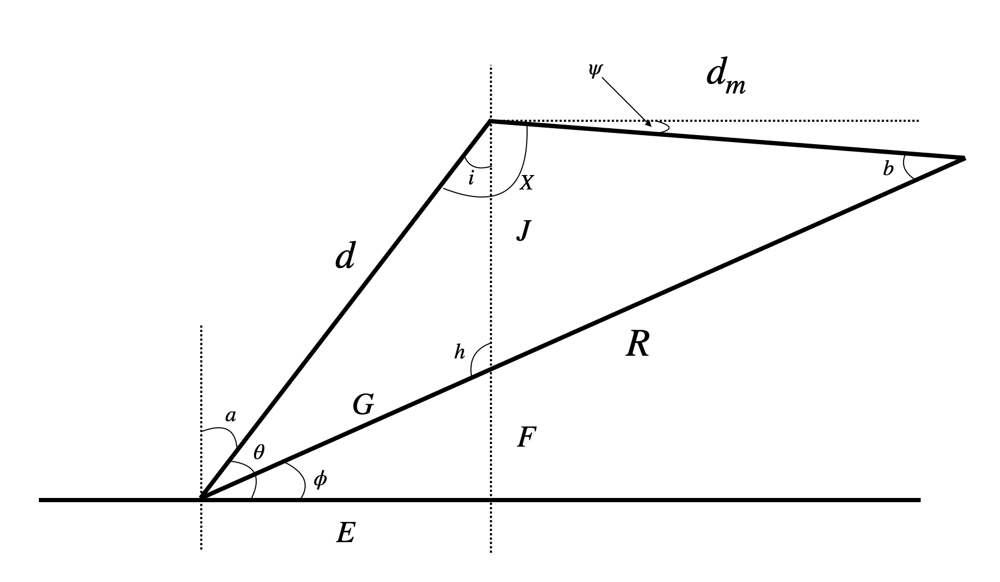

# OrbitalTrajectory
A project for finding the optimal thrust control and orbital trajectory to orbit a rocket around the moon

## Equation Derivation

Here is a detailed derivartion of the equations used in this project. Every symbol comes from the following figure:

 These equations will also be in the $\LaTeX$ write-up. We will first derive $\sin(\psi)$ and $\cos(\psi)$ in terms of $i$ and $x$, and then further derive what those equations are. We first derive $\sin(\psi)$:

$$\begin{aligned}
    \sin(\psi) &= \sin(90+i - x) \\
           &= \sin(90+i)\cos(x) - \cos(90+i)\sin(x) \\\
           &= \big(\sin(90)\cos(i) + \cos(90)\sin(i) \big)\cos(x) \\
           &= -\big(\cos(90)\cos(i) - \sin(90)\sin(i) \big)\sin(x) \\
           &= \cos(i)\cos(x) + \sin(i)\sin(x). \\
\end{aligned}$$

We now derive $\cos(\psi)$:

$$\begin{aligned}
    \cos(\psi) &= \cos(90+i - x) \\
               &= \cos(90+i)\cos(x) + \sin(90+i)\sin(x) \\
               &= \big(\cos(90)\cos(i) - \sin(90)\sin(i) \big)\cos(x) + \big(\sin(90)\cos(i) + \cos(90)\sin(i) \big)\sin(x) \\
               &= \cos(i)\sin(x) - \sin(i)\cos(x). \\
\end{aligned}$$

We $\sin(\psi)$ and $\cos(\psi)$ defined, we now derive $\sin$ and $\cos$ in terms of $i$ and $x$.

First, note that 

$$\begin{equation*}
    \frac{\sin(i)}{E} = \frac{\sin(\theta)}{J}
\end{equation*}$$

where 

$$\begin{aligned}
    E &= d\cos(\theta) \\
    J &= d\sin(\theta) - E\tan(\phi) = d\sin(\theta) - d\cos(\theta)\tan(\phi).
\end{aligned}$$

Substituting $E$ and $J$ into the equation above, we get

$$\begin{aligned}
    \frac{\sin(i)}{d\cos(\theta)} &= \frac{\sin(\theta)}{d\sin(\theta) - d\cos(\theta)\tan(\phi)} \\
    \sin(i) &= \frac{d\cos(\theta)\sin(\theta)}{d\sin(\theta) - d\cos(\theta)\tan(\phi)} \\
\end{aligned}$$

Thus we have $\sin(i)$. Note, for $\sin(x)$, we have

$$\begin{equation*}
    \frac{\sin(x)}{R} = \frac{\sin(\theta-\phi)}{d_m}.
\end{equation*}$$

Thus,

$$\begin{equation*}
    \sin(x) = \frac{R\sin(\theta-\phi)}{d_m}.
\end{equation*}$$

Now that we have $\sin(i)$ and $\sin(x)$, we now turn our attention to $\cos(i)$ and $\cos(x)$. First, note that

$$\begin{equation*}
    \cos(A) = \frac{a^2 - b^2 - c^2}{-2bc} = \frac{b^2 + c^2 - a^2}{2bc}.
\end{equation*}$$

Thus in our situation, we have

$$\begin{equation*}
    \cos(x) = \frac{d^2 + d_m^2 - R^2}{2dd_m}.
\end{equation*}$$

We now define $\cos(i)$ to be

$$\begin{equation*}
    \cos(i) = \frac{d^2 + J^2 - G^2}{2dJ}.
\end{equation*}$$

Recall previously that $J = d\sin(\theta) - d\cos(\theta)\tan(\phi)$. Since $\cos(\phi) = \frac{E}{G} \implies G = \frac{E}{\cos(\phi)}$, we have $G = \frac{d\cos(\theta)}{\cos(\phi)}$. Plugging these values of $J$ and $G$ into the equation for $\cos(i)$, we get

$$\begin{equation*}
    \cos(i) = \frac{d^2 + J^2 - G^2}{2dJ} = \frac{d^2 + (d\sin(\theta) - d\cos(\theta)\tan(\phi))^2 - \left(\frac{d\cos(\theta)}{\cos(\phi)}\right)^2}{2d\big(d\sin(\theta) - d\cos(\theta)\tan(\phi)\big)}.
\end{equation*}$$

We now have the appropriate derivations for $\sin(i)$, $\sin(x)$, $\cos(i)$, and $\cos(x)$. To summarize, we have

$$\begin{aligned}
    \sin(i) &= \frac{d\cos(\theta)\sin(\theta)}{d\sin(\theta) - d\cos(\theta)\tan(\phi)}  &\sin(x) = \frac{R\sin(\theta-\phi)}{d_m} \\
    \cos(i) &= \frac{d^2 + (d\sin(\theta) - d\cos(\theta)\tan(\phi))^2 - \left(\frac{d\cos(\theta)}{\cos(\phi)}\right)^2}{2d\big(d\sin(\theta) - d\cos(\theta)\tan(\phi)\big)} &\cos(x) = \frac{d^2 + d_m^2 - R^2}{2dd_m}.
\end{aligned}$$

## Derivation of Hamiltonian Equation and Stuff for PMP

Before working through the weeds of deriving these equations, we first define our cost functional and initial conditions. For our cost functional we have

$$J[u] = \int_{0}^{t_f}\lVert \textbf{u}(t) \rVert^2 dt + t_f$$

with $\textbf{u}(t) = [u_x,\, u_y]$ (the thrust or acceleration in the $x$ and $y$ directions). For our initial conditions, we have

$$\begin{aligned}
    x(0) &= R_e, &&x(t_f) = L_m \\
    y(0) &= 0, &&y(t_f) = R_m + h_f \\
    x'(0) &= 0, &&x'(t_f) = v_f \\
    y'(0) &= \omega_e, &&y'(t_f) = 0 \\
\end{aligned}$$

where

* $R_e$ is the radius of the Earth (in kilometers),
* $L_m$ is the distance from the Earth to the moon (in kilometers),
* $R_m$ is the radius of the moon (in kilometers),
* $h_f$ is $??$, ${\color{red}\text{check this}}$
* $v_f$ is the final velocity of the rocket (in kilometers per second) ${\color{red}\text{check this}}$,
* $\omega_e$ is the angular velocity of the Earth at the equator (in radians per second).

Since every state has an initial and endpoint condition, we know that our costate vectors are the endpoints are not guaranteed to be zero.

 We now derive the Hamiltonian equation. We have

$$\begin{aligned}
    H = \textbf{p}\cdot\textbf{x}' - L &= \begin{bmatrix}p_1 & p_2 & p_3 & p_4 \end{bmatrix}\begin{bmatrix}x' \\ y' \\ x'' \\ y'' \end{bmatrix} - \lVert \textbf{u} \rVert^2 \\
    &= p_1x' + p_2y' + p_3x'' + p_4y'' - u_x^2 - u_y^2.
\end{aligned}$$

We define $x''$ and $y''$ to be the acceleration in the $x$ and $y$ directions, respectively. We define these to be

$$\begin{aligned}
    x'' &= -\frac{G M_e x}{(x^2 + y^2)^{3/2}} \, + \, \frac{GM_m(L_m - x)}{((L_m - x)^2 + y^2)^{3/2}} + \frac{u_x}{m_r} \\
    y'' &= -\frac{GM_e y}{(x^2 + y^2)^{3/2}} \, - \, \frac{GM_m y}{((L_m-x)^2 +y^2)^{3/2}} + \frac{u_y}{m_r}.
\end{aligned}$$

where 

* $G$ is the gravitational constant (in whatever it is),
* $M_e$ is the mass of the Earth (in kilograms),
* $m_r$ is the mass of the rocket (in kilograms),
* $M_m$ is the mass of the moon (in kilograms),
* $L_m$ is the distance from the Earth to the moon (in kilometers),
* $x$ is the Cartesian $x$-coordinate of the rocket,
* $y$ is the Cartesian $y$-coordinate of the rocket.

Plugging these values into the Hamiltonian equation, we get

$$\begin{aligned}
    H = p_1x' + p_2y' - &p_3\left(\frac{G M_e x}{(x^2 + y^2)^{3/2}} - \frac{GM_m(L_m - x)}{((L_m - x)^2 + y^2)^{3/2}} - \frac{u_x}{m_r}\right) \\
    &- p_4\left(\frac{GM_e y}{(x^2 + y^2)^{3/2}} + \frac{GM_m y}{((L_m-x)^2 +y^2)^{3/2}} - \frac{u_y}{m_r}\right) - u_x^2 - u_y^2.
\end{aligned}$$

We now derive the necessary equations for the PMP. We first derive the necessary equations for the adjoint equations (co-state evolution). We have

$$\begin{aligned}
    \dot{p}_1 = -\frac{\partial H}{\partial x} = \;&p_3\left(\frac{3GM_m(L-x)^2}{\big((L-x)^2 + y^2\big)^4} - \frac{GM_m}{2\big((L-x)^2 + y^2 \big)^3} + \frac{3GM_e x^2}{\big(x^2+y^2\big)^{5/2}} - \frac{GM_e}{\big(x^2 + y^2\big)^{3/2}} \right) \\
        &\;+p_4\left(\frac{-3GM_m(L-x)y}{((L-x)^2+y^2)^4} + \frac{3GM_e xy}{(x^2+y^2)^{5/2}} \right) \\
    
    \dot{p}_2 = -\frac{\partial H}{\partial y} = &\;p_4\left(\frac{3GM_m y^2}{\big((L-x)^2+y^2\big)^4} - \frac{GM_m}{2\big((L-x)^2+y^2\big)^3} + \frac{3GM_e y^2}{\big(x^2+y^2\big)^{5/2}} - \frac{GM_e}{\big(x^2+y^2\big)^{3/2}} \right) \\
    &\;+p_3\left(\frac{-3GM_m (L-x)y}{((L-x)^2+y^2)^4} + \frac{3GM_e xy}{(x^2+y^2)^{5/2}} \right) \\
        
    \dot{p}_3 = -\frac{\partial H}{\partial x'} = \;&-p_1 \\
    \dot{p}_4 = -\frac{\partial H}{\partial y'} = \;&-p_2.
\end{aligned}$$

